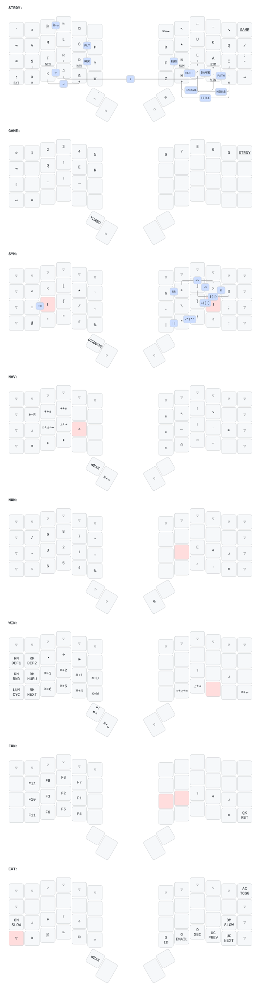

# QMK Keymap

Personal [QMK](https://qmk.fm) userspace for my [ZSA
Voyager](https://www.zsa.io/voyager), built on the External Userspace template.
It holds my keymap, config, and a couple of personal QMK community modules.

## Keyboard

- **Board:** ZSA Voyager (`zsa/voyager`)
- **Base layout:** Magic Sturdy (inspired from [getreuer](https://github.com/getreuer/qmk-keymap)'s keymaps)

## Layout

[](keyboards/zsa/voyager/keymaps/omareloui/draw_keymap.yaml)

(Rendered with [keymap-drawer](https://github.com/caksoylar/keymap-drawer))

Layers, in order:

| Layer   | Purpose                                                                     |
| ------- | --------------------------------------------------------------------------- |
| `STRDY` | Base alpha layer (home row mods for Shift/Ctrl/Alt/GUI + layer taps)        |
| `GAME`  | Flat WASD-friendly layer for gaming                                         |
| `SYM`   | Symbols                                                                     |
| `NAV`   | Navigation, window/tab switching, text selection helpers                    |
| `NUM`   | Numpad-style numbers and math operators                                     |
| `WIN`   | Media keys, RGB matrix controls, window management (macOS-style GUI combos) |
| `FUN`   | Function keys, reboot                                                       |
| `EXT`   | Extra: clipboard ops, Unicode input, mouse jiggler, Orbital Mouse controls  |

Home row mods use **Chordal Hold** and **tapping term**.

### Legend

The diagram uses glyphs instead of raw keycode names (mapped in `draw_config.yaml`'s `qmk_keycode_map`). Reference for reading it:

| Symbol  | Meaning                        |
| ------- | ------------------------------ |
| ↵       | Enter                          |
| ␣       | Space                          |
| ⎋       | Escape                         |
| ⌫       | Backspace                      |
| ⌦       | Delete                         |
| ⇥       | Tab                            |
| ⎈       | Ctrl (left/right)              |
| ⇧       | Shift (left/right)             |
| ⎇       | Alt (left/right)               |
| ⌘       | GUI / Super / Cmd (left/right) |
| ⇪       | Caps Word                      |
| ⇞       | Page Up                        |
| ⇟       | Page Down                      |
| ↖       | Home                           |
| ↘       | End                            |
| ← ↓ → ↑ | Arrow keys                     |
| 🕪       | Volume Up                      |
| 🕩       | Volume Down                    |
| 🕨       | Mute                           |
| ★       | Magic key                      |
| ⟲       | Repeat Key                     |
| ⧉       | Copy                           |
| ✂       | Cut                            |
| 🗎       | Paste                          |
| ⎁       | Select All                     |
| ⎀       | Select Line                    |
| ⟾       | Select Word Forwards           |
| ⟽       | Select Word Backwards          |
| ⎌       | Undo                           |
| ⎙       | Print screen                   |
| ▶⏸      | Play/Pause media               |
| ▶❘      | Next media                     |
| ⌕       | Search selected in new tab     |

## Modules

Community modules pulled in via `.gitmodules` and declared in `keymap.json`:

**From [getreuer/qmk-modules](https://github.com/getreuer/qmk-modules):**

- **Sentence Case** – auto-capitalizes the first letter after sentence-ending punctuation
- **Custom Shift Keys** – per-key alternate output when shifted, restricted here to layers 0, 1, and 5
- **Select Word** – smarter word/line selection helpers (`SELWORD` / `SELWBAK` / `SELLINE`)
- **Lumino** – opinionated RGB matrix lighting control scheme (`LUM_CYC`)
- **PaletteFx** – RGB matrix effects/palettes, all effects and palettes enabled
- **Orbital Mouse** – joystick-style cursor movement from a key cluster, with a custom speed curve
- **Mouse Turbo Click** – auto-repeating mouse clicks (`TURBO`, used on the `GAME` layer)

**Own module (`modules/omareloui/xcase`):**

- **XCase** – converts the following typed word into `camelCase`, `PascalCase`, `snake_case`, `kebab-case`, `Title Case`, or `path/case` on demand

## Other notable features

- **Combos** (`COMBO_ENABLE`) for punctuation and home-row-mod letter pairs
- **Autocorrect** with a custom dictionary (`autocorrection_dict.txt` / generated `autocorrect_data.h`)
- **Repeat Key** and **Layer Lock** for one-shot key repeats and stuck-on layers
- **Dynamic Macros** (nesting disabled)
- **Mouse keys** with a jigger keycode (`JIGGLE`, gated behind `ENABLE_MOUSE_JIGGLER`) to keep a session alive
- A handful of personal macros (email/username/ID snippets, symbol pairs, Magic-key expansions) implemented in `keymap.c`

## Configuring QMK

1. Install and set up the QMK CLI if you haven't already — see the [QMK docs](https://docs.qmk.fm/#/newbs).
2. Fork and clone this repository.
3. Point QMK at this userspace:

   ```sh
   qmk config user.overlay_dir="$(realpath qmk-keymap)"
   ```

4. (Optional) list or manage build targets:

   ```sh
   qmk userspace-list
   qmk userspace-add -kb zsa/voyager -km omareloui
   qmk userspace-remove -kb zsa/voyager -km omareloui
   ```

   The `zsa/voyager` + `omareloui` target is already declared in `qmk.json`, so this is only needed if you add more keymaps.

## Building

**Locally**, from inside the cloned repo:

```sh
qmk config user.overlay_dir="$(realpath .)"
qmk compile -kb zsa/voyager -km omareloui
# or
make zsa/voyager:omareloui
# or, to build every target listed in qmk.json:
qmk userspace-compile
```

This pulls in the `modules/getreuer` submodule automatically — run `git submodule update --init --recursive` first if you cloned without `--recurse-submodules`.

You can use `git submodule update --remote --recursive` to pull in updates from the upstream `getreuer/qmk-modules` repo.

There's also a `.devcontainer` (based on `ghcr.io/qmk/qmk_cli`) if you'd rather build inside VS Code / Codespaces without installing the toolchain locally.

**Via GitHub Actions:**

1. Enable Actions on your fork.
2. Push to `main` (or trigger the workflow manually).
3. `build_binaries.yaml` runs the reusable `qmk_userspace_build` / `qmk_userspace_publish` workflows against `qmk/qmk_firmware@develop`.
4. Grab the compiled `.bin`/`.uf2` from the fork's **Releases** tab once the run finishes.

## Flashing

1. Put the Voyager into bootloader mode (via [ZSA's Wally tool](https://www.zsa.io/flash) or the key combo for your layout).
2. Flash with QMK directly:

   ```sh
   qmk flash -kb zsa/voyager -km omareloui
   ```

3. Alternatively, drag-and-drop the built firmware file using Wally, or use the ZSA online flasher if you built via GitHub Actions.
4. Repeat for both halves if your firmware/EEPROM settings require it.

## License

GPL-2.0, consistent with QMK firmware itself. See `LICENSE`.
